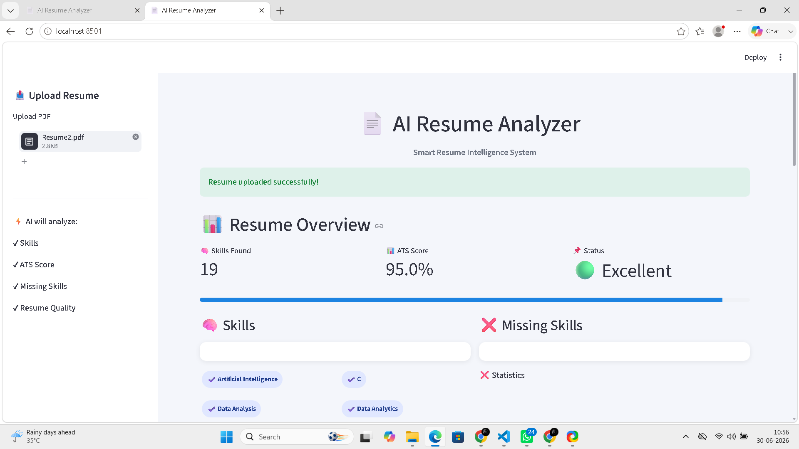

# 📄 AI Resume Analyzer 

An AI-powered Resume Screening and ATS Scoring system that analyzes resumes and provides intelligent insights like skills extraction, missing skills detection, ATS scoring and personalized feedback.

---

## 🚀 Features

- 📤 Upload Resume (PDF)
- 🧠 Automatic Skill Extraction
- 📊 ATS Score (Realistic scoring system)
- ❌ Missing Skills Detection
- 🤖 AI Feedback Engine (improvements + job suggestions)
- 📈 Skill Distribution Visualization
- 📋 Resume Summary Insights
- 🎯 Industry Role Suggestions

---

## 🛠️ Tech Stack

- Python 🐍
- Streamlit 🎈
- Pandas 📊
- NLP (Rule-based extraction)
- PDF Parsing

---

## 📊 How ATS Score Works

The ATS score is calculated using a **realistic scoring system**:

- Skill coverage (major factor)
- Penalty for missing key skills (ML, DL, NumPy, Flask, Django)
- Resume completeness (projects, education, certifications)
- Skill diversity check

👉 This ensures the score is **realistic and not artificially 100%**

---

## 📷 Screenshot



---

## 🧠 AI Feedback System

The system provides:

- Why your score is high/low
- Personalized improvement suggestions
- Missing skill recommendations
- Industry job role suggestions (Data Analyst / AI Engineer)

---

## Author

R.Indhu Varshini

---

## ▶️ Run Locally

```bash
pip install -r requirements.txt
python -m streamlit run app.py
